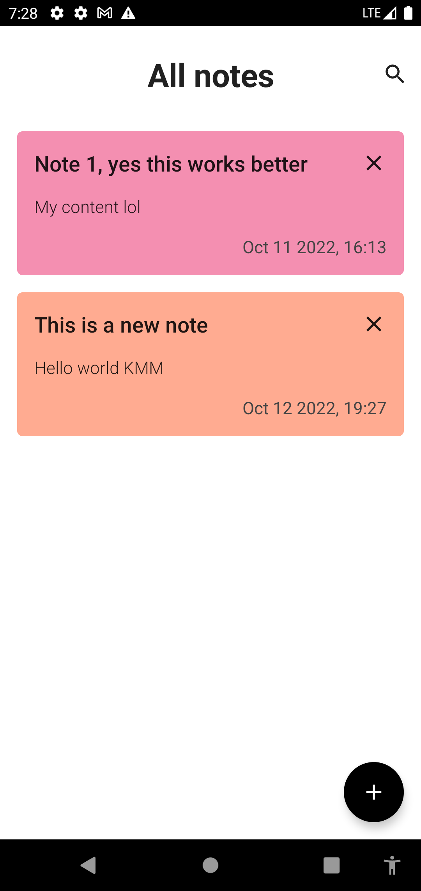

# Clean Architecture CRUD App Using Kotlin Multiplatform Mobile

This is an app for taking notes created in Kotlin Multiplatform Mobile.

| iOS                                            | Android                                                |
|------------------------------------------------|--------------------------------------------------------|
|      |      |
|  |  |

First of all we need to add dependencies for both platform.
Dependencies are added on the `shared` module in the [`build.gradle.kts`](shared/build.gradle.kts) file.

## Adding dependencies

```kotlin
implementation("com.squareup.sqldelight:runtime:1.5.3")
implementation("org.jetbrains.kotlinx:kotlinx-datetime:0.4.0")
```

SQLDelight is write is pure kotlin and support KMM.

Also, we need to add the specific driver for each platform in:
- **androidMain** `implementation("com.squareup.sqldelight:android-driver:1.5.3")`
- **iosMain** `implementation("com.squareup.sqldelight:native-driver:1.5.3")`

And also add the plugin of SQLDelight. This allow generate corresponding entity classes at compile time in out project.

**`id("com.squareup.sqldelight")`**

```kotlin
plugins {
    kotlin("multiplatform")
    id("com.android.library")
    id("com.squareup.sqldelight")
}
```

Also, we change a little default config for [build.gradle.kts](./build.gradle.kts)

```kotlin
buildscript {
    repositories {
        gradlePluginPortal()
        google()
        mavenCentral()
    }
    dependencies {
        classpath("org.jetbrains.kotlin:kotlin-gradle-plugin:1.7.10")
        classpath("com.android.tools.build:gradle:7.2.2")
        classpath("com.squareup.sqldelight:gradle-plugin:1.5.3")
        classpath("com.google.dagger:hilt-android-gradle-plugin:2.42")
    }
}

allprojects {
    repositories {
        google()
        mavenCentral()
    }
}

tasks.register("clean", Delete::class) {
    delete(rootProject.buildDir)
}
```

And also we need to add some dependencies on android side [build.gradle.kts](androidApp/build.gradle.kts).

```kotlin
plugins {
    ...
    id("kotlin-kapt")
    id("dagger.hilt.android.plugin")
}

android {
    ...
    compileOptions {
        isCoreLibraryDesugaringEnabled = true
    }
}

dependencies {
    ...
    coreLibraryDesugaring("com.android.tools:desugar_jdk_libs:1.1.5")

    implementation("org.jetbrains.kotlinx:kotlinx-datetime:0.4.0")

    implementation("com.google.dagger:hilt-android:2.42")
    kapt("com.google.dagger:hilt-android-compiler:2.42")
    kapt("androidx.hilt:hilt-compiler:1.0.0")
    implementation("androidx.hilt:hilt-navigation-compose:1.0.0")
}
```

:star: After that, you can run the Android and iOS emulator to check everything is working fine.

## Implementing the database

We need to create the directory where is generated all classes for SQLDelight **sqldelight/database** inside path `shared/src/commonMain/sqldelight/database` - **shared/src/commonMain**

And setup the project on [build.gradle.kts](shared/build.gradle.kts)

```kotlin
sqldelight {
    database("NoteDatabase") {
        packageName = "com.crexative.noteappkmm.database"
        sourceFolders = listOf("sqldelight")
    }
}
```

And also, we need to install the plugin SQLDelight to Generates typesafe Kotlin APIs from SQL, and provides language features for SQL inside the IDE.

And after that, we can created out files for the database. For example the [`note.sq`](sqldelight/database/note.sq) and write the respective code in SQL.

### Database schema

After, that we write the SQL sentences on [note.sq](sqldelight/database/note.sq) file, we need to rebuild the project to generate the class with the plugin installed previously.

If all is done well, we can use the `private val db = NoteEntity()` sentence to check if the class are generated successful on [generated](shared/build/generated/sqldelight/code/NoteDatabase/commonMain/database).


## Note Domain Model

In the commonMain we write the all shared code tha we can use on both platforms.
In this case, make sense create all the business logic for our application.

For the database, as each platform have your own driver, we need to create a class with the **expect** keyword to implement on the respective platform.

**expect** Basically tell us what needs to be implemented on the respective platform. With the **actual** keyword.

[DatabaseDriverFactory.kt](shared/src/commonMain/kotlin/com/crexative/noteappkmm/data/local/DatabaseDriverFactory.kt)
```kotlin
expect class DatabaseDriverFactory {
    fun createDriver(): SqlDriver
}
```

And we need to implement this class on android and ios packages.

Android [DatabaseDriverFactory.kt](shared/src/androidMain/kotlin/com/crexative/noteappkmm/data/local/DatabaseDriverFactory.kt)
```kotlin
actual class DatabaseDriverFactory(private val context: Context) {

    actual fun createDriver() : SqlDriver {
        return AndroidSqliteDriver(NoteDatabase.Schema, context, "note.db")
    }

}
```

iOS [DatabaseDriverFactory.kt](shared/src/iosMain/kotlin/com/crexative/noteappkmm/data/local/DatabaseDriverFactory.kt)
```kotlin
actual class DatabaseDriverFactory {

    actual fun createDriver() : SqlDriver {
        return NativeSqliteDriver(NoteDatabase.Schema, "note.db")
    }

}
```

The project structure for **commonMain** is

```kotlin
commonMain/
├── data/
│   ├──local/
│   │    └──DatabaseDriverFactory.kt
│   └──note/
│        ├── NoteMapper.kt
│        └── SqlDelightNoteDataSource.kt
├── domain/
│   ├──note/
│   │    ├── Note.kt
│   │    ├── NoteDataSource.kt
│   │    └── SearchNotes.kt
│   └──time/
│        └── DateTimeUtil.kt
│
└── presentation/
    └── Colors.kt
```

## Presentation - Android

**combine** triggered when some of single arguments emits a value

```kotlin
val state = combine(notes, searchText, isSearchActive) { notes, searchText, isSearchActive ->
    NoteListState(
        notes = searchNotes.execute(notes, searchText),
        searchText = searchText,
        isSearchActive = isSearchActive
    )
}.stateIn(viewModelScope, SharingStarted.WhileSubscribed(5000), NoteListState())
```

Also, it's consider have a stateHandle for android, when something happen and android killed the process.

```kotlin
private val notes = savedStateHandle.getStateFlow("notes", emptyList<Note>())
private val searchText = savedStateHandle.getStateFlow("searchText", "")
private val isSearchActive = savedStateHandle.getStateFlow("isSearchActive", false)
```

To create a list of notes to test, you can do this on the ViewModel

```kotlin
init {
    viewModelScope.launch {
        (1..10).forEach {
            noteDataSource.insertNote(
                Note(
                    id = null,
                    title = "Note $it",
                    content = "My content $it",
                    colorHex = Note.generateRandomColor(),
                    created = DateTimeUtil.now()
                )
            )
        }
    }
}
```

## Compose navigation

This is the usage for navigation in the app in [MainActivity.kt](androidApp/src/main/java/com/crexative/noteappkmm/android/MainActivity.kt).

```kotlin
val navController = rememberNavController()
NavHost(navController = navController, startDestination = "note_list") {
    composable(route = "note_list") {
        NoteListScreen(navController = navController)
    }
    composable(
        route = "note_detail/{noteId}",
        arguments = listOf(
            navArgument(name = "noteId") {
                type = NavType.LongType
                defaultValue = -1L
            }
        )
    ) { backStackEntry ->
        val noteId = backStackEntry.arguments?.getLong("noteId") ?: -1L
        NoteDetailScreen(noteId = noteId, navController = navController)
    }
}
```

## Presentation in IOS 

> :bulb: We can't build the iOS UI in Android Studio, we need to use xcode for that and you need a mac because only runs on a Mac and we will now be using Swift and Swift UI for building the UI.

To test insert notes on iOS, we can do it the next:

```swift
noteDataSource.insertNote(note: Note(id: nil, title: "Note title", content: "Note content", colorHex: 0xFFF543, created: DateTimeUtil().now()), completionHandler: { error in
    
})
```